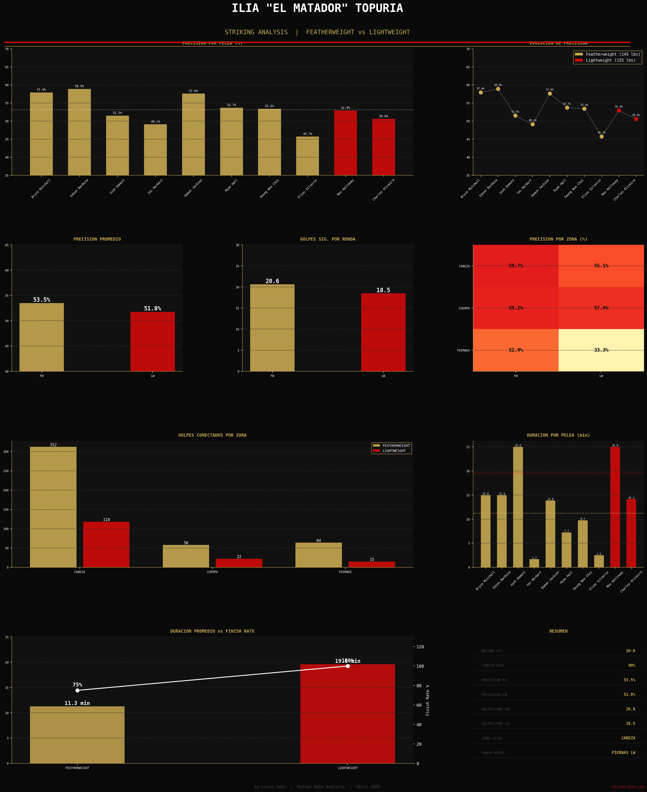

# Ilia Topuria - Striking Analysis UFC
> Comparativa estadistica de striking en Featherweight vs Lightweight

## Descripcion
Analisis exploratorio de datos sobre el striking de Ilia "El Matador" Topuria 
en sus peleas de UFC, comparando precision y volumen de golpeo entre categorias.

## Hallazgos principales
| Categoria | Sig. Strike % | Golpes/Ronda |
|-----------|:------------:|:------------:|
| Featherweight (145 lbs) | 53.5% | 20.6 |
| Lightweight (155 lbs) | 51.8% | 18.5 |

> Topuria bajo apenas 1.7% de precision al subir de categoria enfrentando a Holloway y Oliveira.

## Visualizacion

## Tecnologias
Python 3.11 | pandas | matplotlib | seaborn

## Autor
Lucas Sanz | Racing Data Lab | Abril 2026
